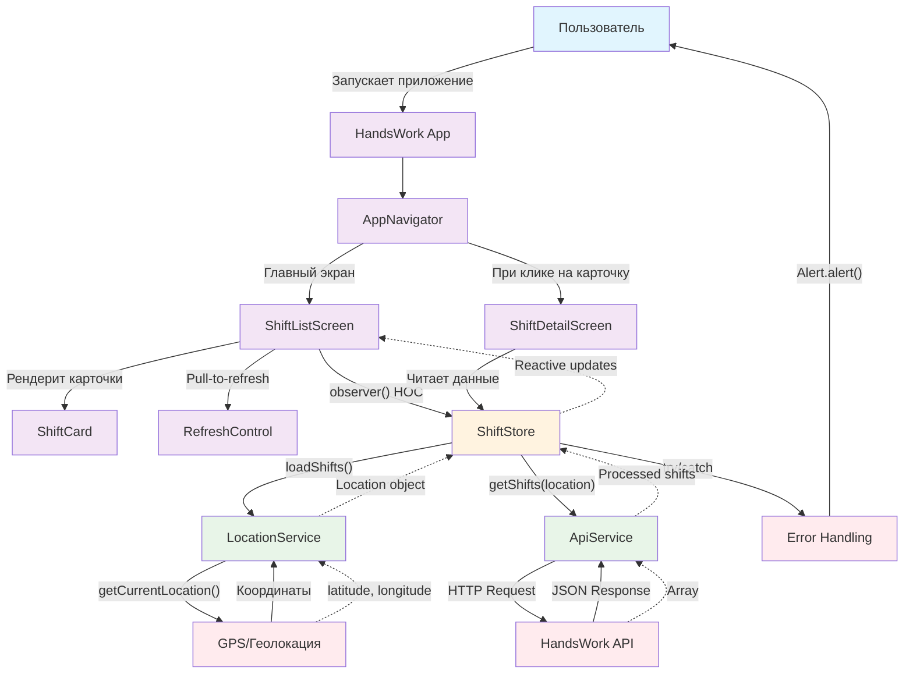
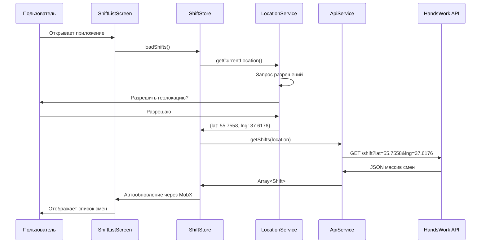
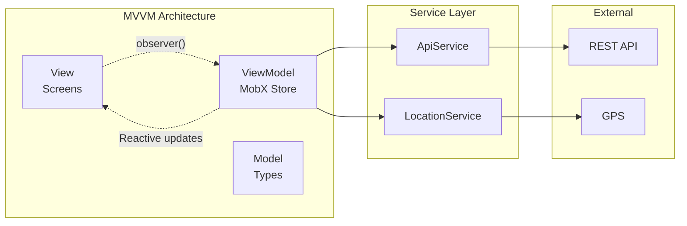
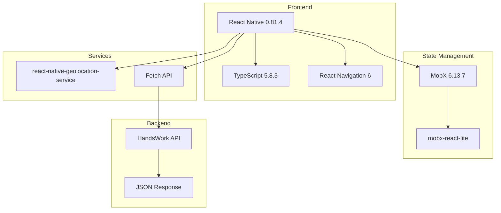

# Архитектурная диаграмма HandsWork App

## Схема архитектуры приложения

```mermaid
graph TB
    %% User Layer
    User[Пользователь] --> |"Запускает приложение"| App[HandsWork App]

    %% React Native Layer
    App --> Navigator[AppNavigator]
    Navigator --> |"Главный экран"| ShiftList[ShiftListScreen]
    Navigator --> |"При клике на карточку"| ShiftDetail[ShiftDetailScreen]

    %% Screen Components
    ShiftList --> |"Рендерит карточки"| ShiftCard[ShiftCard]
    ShiftList --> |"Pull-to-refresh"| Refresh[RefreshControl]

    %% State Management Layer
    ShiftList --> |"observer() HOC"| ShiftStore[ShiftStore]
    ShiftDetail --> |"Читает данные"| ShiftStore

    %% Services Layer
    ShiftStore --> |"loadShifts()"| LocationService[LocationService]
    LocationService --> |"getCurrentLocation()"| GPS[GPS/Геолокация]

    ShiftStore --> |"getShifts(location)"| ApiService[ApiService]
    ApiService --> |"HTTP Request"| API[HandsWork API]

    %% External Systems
    GPS --> |"Координаты"| LocationService
    API --> |"JSON Response"| ApiService

    %% Error Handling
    ShiftStore --> |"try/catch"| ErrorHandler[Error Handling]
    ErrorHandler --> |"Alert.alert()"| User

    %% Data Flow Annotations
    GPS -.-> |"latitude, longitude"| LocationService
    LocationService -.-> |"Location object"| ShiftStore
    API -.-> |"Array<Shift>"| ApiService
    ApiService -.-> |"Processed shifts"| ShiftStore
    ShiftStore -.-> |"Reactive updates"| ShiftList

    %% Styling
    classDef userLayer fill:#e1f5fe
    classDef uiLayer fill:#f3e5f5
    classDef storeLayer fill:#fff3e0
    classDef serviceLayer fill:#e8f5e8
    classDef externalLayer fill:#ffebee

    class User userLayer
    class App,Navigator,ShiftList,ShiftDetail,ShiftCard,Refresh uiLayer
    class ShiftStore storeLayer
    class LocationService,ApiService serviceLayer
    class GPS,API,ErrorHandler externalLayer
```

## Поток данных при запуске

```mermaid
sequenceDiagram
    participant U as Пользователь
    participant SL as ShiftListScreen
    participant SS as ShiftStore
    participant LS as LocationService
    participant AS as ApiService
    participant API as HandsWork API

    U->>SL: Открывает приложение
    SL->>SS: loadShifts()
    SS->>LS: getCurrentLocation()
    LS->>LS: Запрос разрешений
    LS->>U: Разрешить геолокацию?
    U->>LS: Разрешаю
    LS->>SS: {lat: 55.7558, lng: 37.6176}
    SS->>AS: getShifts(location)
    AS->>API: GET /shift?lat=55.7558&lng=37.6176
    API->>AS: JSON массив смен
    AS->>SS: Array<Shift>
    SS->>SL: Автообновление через MobX
    SL->>U: Отображает список смен
```

## Архитектурные паттерны

```mermaid
graph LR
    %% MVVM Pattern
    subgraph "MVVM Architecture"
        V[View<br/>Screens]
        VM[ViewModel<br/>MobX Store]
        M[Model<br/>Types]
    end

    %% Service Layer
    subgraph "Service Layer"
        API[ApiService]
        LOC[LocationService]
    end

    %% External APIs
    subgraph "External"
        REST[REST API]
        GPS[GPS]
    end

    V -.->|"observer()"| VM
    VM --> API
    VM --> LOC
    API --> REST
    LOC --> GPS

    %% Data binding
    VM -.->|"Reactive updates"| V
```

## Технологический стек

```mermaid
graph TB
    subgraph "Frontend"
        RN[React Native 0.81.4]
        TS[TypeScript 5.8.3]
        NAV[React Navigation 6]
    end

    subgraph "State Management"
        MOBX[MobX 6.13.7]
        OBS[mobx-react-lite]
    end

    subgraph "Services"
        GEO[react-native-geolocation-service]
        HTTP[Fetch API]
    end

    subgraph "Backend"
        API[HandsWork API]
        JSON[JSON Response]
    end

    RN --> TS
    RN --> NAV
    RN --> MOBX
    MOBX --> OBS
    RN --> GEO
    RN --> HTTP
    HTTP --> API
    API --> JSON
```
